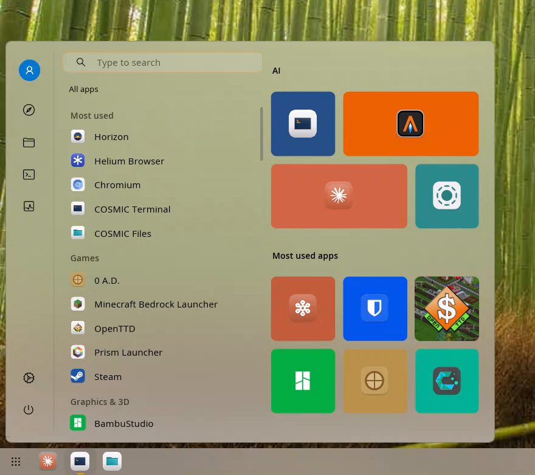

# Start Menu for COSMIC

A Windows 10-style Start menu for the [COSMIC desktop](https://system76.com/cosmic),
built as a panel applet. Styled entirely by COSMIC's own Appearance settings —
light and dark mode, accent colour, roundness and frosted glass all follow
what you've set.

**Status: alpha.** Day-to-day usable; the config file is TOML and may
occasionally gain a new field.



A short demo (search, keyboard navigation, animated tile) is in
[`docs/demo.mp4`](docs/demo.mp4).

## Features

- **Instant open.** A resident process is pre-warmed at login, so the menu
  appears in a frame and never gets stuck "loading apps".
- **Fade and rise.** Opens with a short fade-in while rising into place, and
  reverses on close.
- **Keyboard-driven.** Type to search, ↑ ↓ to pick a result, Enter to launch.
  Tab moves between the side rail, the app list and the tile grid; arrow keys
  walk whichever one you're in. A plain letter in the list jumps to that
  section.
- **Three app views.** A–Z, by category, or by the folders you made in
  COSMIC's App Library.
- **Tiles with brand colours.** Each tile picks its own fill from the app's
  icon, like a Windows live tile. Turn it off in Settings.
- **Picture and GIF tiles.** Point a tile at an image or an animated GIF.
  Right-click a tile for motion options: loop, play once, or only animate
  while highlighted. The icon is hidden by default when a picture is set.
- **Pinned, favourites or recent.** The right column shows one of three:
  your pinned tile groups, your dock favourites as a plain grid, or your
  recently-launched apps.
- **Side rail.** Account picture, Files, Settings and Power (lock, log out,
  sleep, restart, shut down). Log out, restart and shut down use COSMIC's
  own confirmation dialog.
- **Follows your theme.** Appearance settings drive everything visual.
  Nothing is hard-coded. The one exception is the tile *finish* (frosted,
  solid, outline, accent), which is the menu's own setting.

## Install

### From source

Requires Rust (stable), `just`, and the usual COSMIC build dependencies.
On Arch:

```sh
sudo pacman -S rust just libxkbcommon wayland
```

Then:

```sh
git clone https://github.com/jjnuthuagen/cosmic-start-menu-applet.git
cd cosmic-start-menu-applet
just install
```

That installs the binary and both desktop entries to `~/.local`. Add
**Start Menu** in **Settings → Desktop → Panel → Configure applets**.

To install system-wide instead:

```sh
sudo just prefix=/usr install
```

### Bind to the Super key

The menu is a layer-surface popup, so Super needs a custom keyboard shortcut:

**Settings → Input Devices → Keyboard → Custom Shortcuts**, add:

```
~/.local/bin/cosmic-start-menu-applet --toggle
```

Bind it to Super (`Super_L`). Press Super and the menu opens.

## Using it

- **Open:** click the panel button, or press Super.
- **Search:** just start typing.
- **Right-click an app** in the list or tiles for pin / resize / rename /
  "add to favourites" / app actions.
- **Edit a tile group:** right-click a tile and choose **Edit**. Tap a tile
  to pick it up and tap where it should go.
- **Settings:** right-click the panel button, or click the gear in the rail.

## Config

Config lives at `~/.config/cosmic-start-menu-applet/config.toml`. Most
things have a Settings UI; the file is TOML and safe to hand-edit. See
the comment block at the top for every key.

Set a tile picture:

```toml
[[group.tiles]]
app = "com.anthropic.Claude"
size = "wide"
image = "/path/to/picture.gif"
motion = "loop"    # loop | once | on_highlight
```

An animated GIF plays while the menu is open. The app icon is hidden by
default when a picture is set — right-click the tile and tick **icon over
image** to put it back.

## Building

```sh
just build        # cargo build --release
just verify       # fmt + clippy + tests, what CI runs
just restart      # cycle the panel applet to reload a fresh install
```

The CI workflow in `.github/workflows/build.yml` runs the same checks on
every push and pull request.

## Contributing

See [CONTRIBUTING.md](CONTRIBUTING.md) for how to build, test and open an
issue or pull request.

## License

Dual-licensed under the Apache License 2.0 and the MIT License. Pick
whichever you prefer; the two LICENSE files have the terms.
